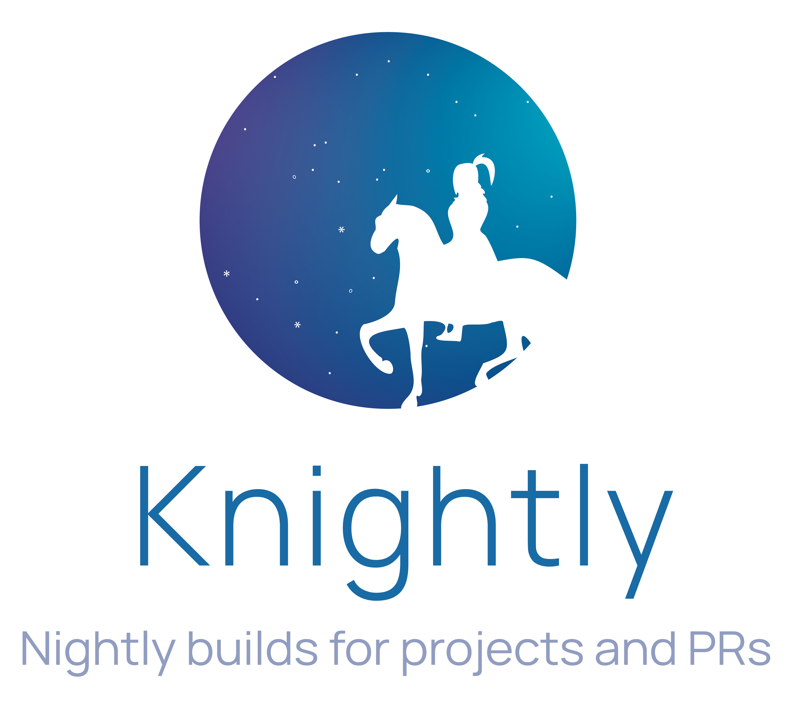
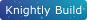
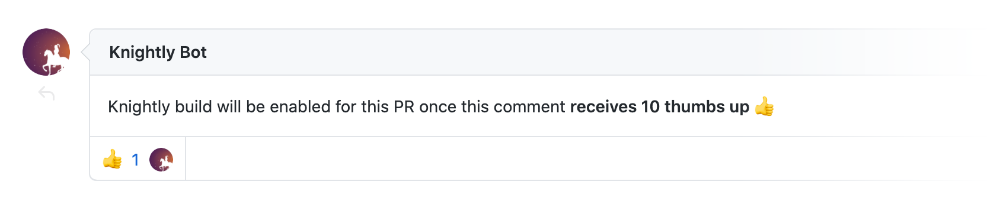
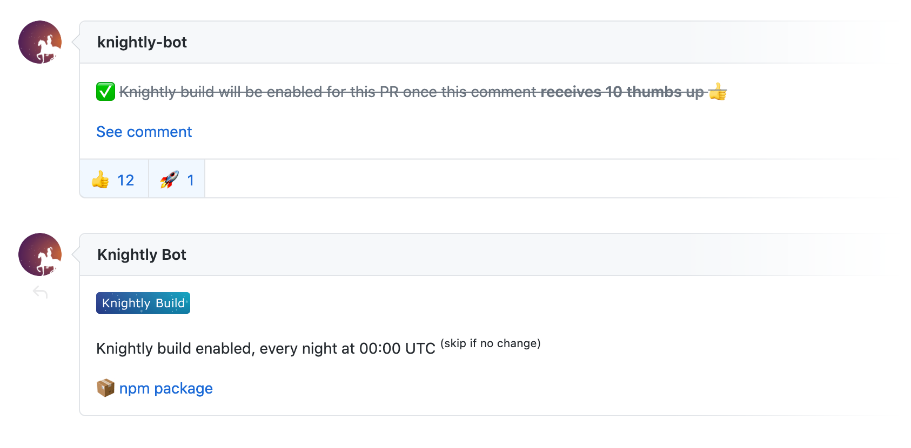

<p align='center'>
  
</p>

<p align='center'>

<p>

<br>

## Motivation

Waiting for PRs getting merged and new version getting released sometimes can be a long process. And I do understand sometimes an annoying bug could block the progress of your projects, or you are just excited to try the new feature.

So I made `Knightly`, trying to **make the nightly build process universally available to any projects**. Don't get frustrated when the maintainers are not available to make releases. And maintainers could also have less pressure to make everything on schedule.

## Usages

### Community Maintained Builds

Community maintained builds will be published under the [@knightly](https://www.npmjs.com/org/knightly) npm org. You can find the active build tasks in [knightlyjs/tasks](https://github.com/knightlyjs/tasks).

#### Request for Repo

It's currently a manual process. [Submit your request issue](https://github.com/knightlyjs/tasks/issues/new?assignees=&labels=repo-request&template=knightly-build-request.md&title=%5BRequest%5D) for repos you would like to enable Knightly on, and we will add it for you.

#### Request for PRs

Once the repo enables Knightly, everyone can pin [@knightly-bot](https://github.com/knightly-bot) in **a PR**, like:

```css
@knightly-bot build this
```


The bot will leaves a comment asking the community to vote on it. 



If the comment receives 10 thumbs up 👍. The nightly build for the PR will be enabled automatically.



Scripts for the bot can be found in [knightlyjs/bot](https://github.com/knightlyjs/bot)

### Standalone Use

> 🚧 Support for project owners / maintainers to make official nightly builds on their own will be added later. We are currently focusing on Community Maintained Builds support.

### APIs

> 🚧 This project is still under heavy development, the APIs may change without advance notice. You can use TypeScript auto-completion for now.

### Badge 


```md

```

## Sponsors

This project is part of my <a href='https://github.com/antfu-sponsors'>Sponsor Program</a>

<p align="center">
  <a href="https://cdn.jsdelivr.net/gh/antfu/static/sponsors.svg">
    
  </a>
</p>

## License

MIT
